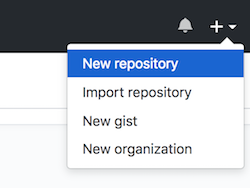
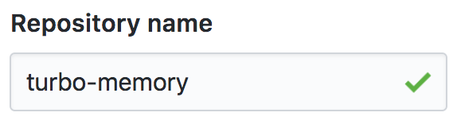
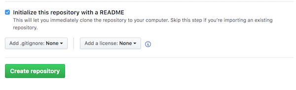
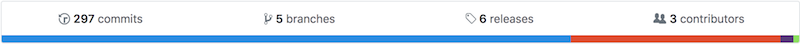
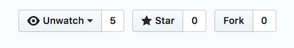
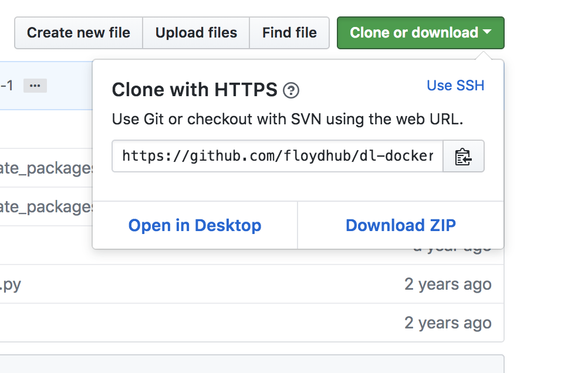
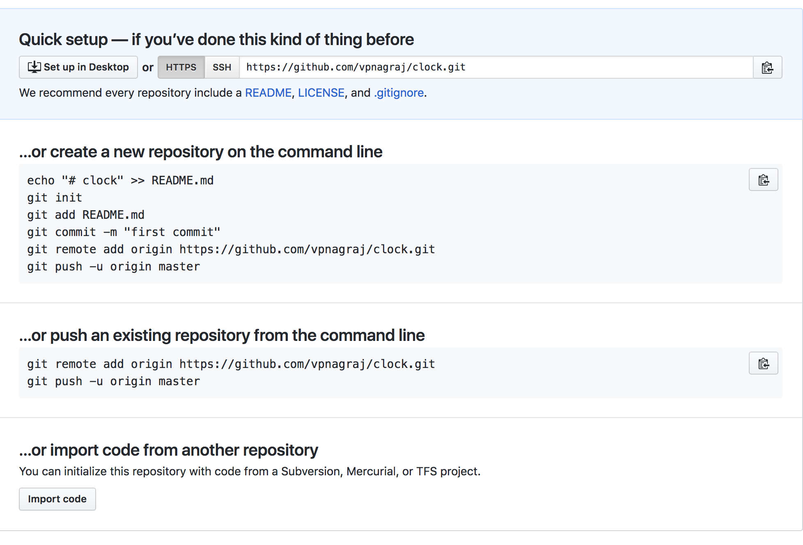

## Introduction

Version control software provides a systematic way to keep track of changes made to files. There are a number of version control software (VCS) systems ... Git is one of them. It's a powerful tool for tracking and reconciling changes to text files from individual or multiple contributors. The basic unit of Git is the repository. Unlike some other VCS, Git tracks changes by storing **snapshots** of entire repository at different points in time. This is internally different than "delta-based" system that just keeps track of changes to the files (https://git-scm.com/book/en/v2/Getting-Started-Git-Basics). While Git can be used as a standalone piece of software, many people leverage web hosting platforms that expand the VCS functionality and have project management and collaborative features built in. Several examples of these services include [Bitbucket](https://bitbucket.org/), [GitLab](https://about.gitlab.com/) and [GitHub](https://github.com/).

## GitHub

As we mentioned in the introduction, GitHub is a web-based platform for hosting Git repositories. The platform includes a web interface to explore files and perform version control operations, as well as a number of collaboration tools for commenting, opening requests for new features, using project management methods, social networking, creating versions of software releases, and many more. GitHub is an extremely popular service, particularly among software developers and scientists who want to share code as part of "open source" projects.

### 1. Log into github.com

To begin with we'll log into [github.com](https://github.com/)

If you haven't already created an account, make sure you follow the steps to do so.

### 2. Click the `+` icon and select "New repository"



### 3. Give the repository a name

Like the prompt suggests, repository names should be short and memorable. And they must be unique to your account ... i.e. you can't have two repositories in your account with the same name.



### 4. Check the box to "Initialize this repository with a README"

New repositories on GitHub require contents to initialize. To get started, we can initialize with a README file, which are typically included in repositories to provide a description of content, usage and / or any necessary software setup.



### 5. Create a new file

GitHub provides a file editor in the browser. We're going to make use of that here to demonstrate some of the basic concepts of version control ... but **nb** that editing files this way is not a typical workflow, especially if you're storing versions of your code locally (on your computer) and remotely (on GitHub). More on that later ...

```
smpl <- rnorm(1000)

xbar <- mean(x)
s <- sd(x)

hist(smpl)
```

### 6. Edit the file

```
smpl <- rnorm(1000)

xbar <- mean(x)
s <- sd(x)

hist(smpl)
abline(v = xbar, lwd = 2, col = "red")
abline(v = xbar + 2*s, lwd = 2, col = "red", lty = 3)
abline(v = xbar - 2*s, lwd = 2, col = "red", lty = 3)
```

### 7. Take a look at the commit history and branch explorer



Each change to the repository (or **commit**) is recorded and tracked separately via a unique combination of characters. This **hash** is abbreviated in the commit history view, which provides an interface to explore the file(s) and line(s) that were changed as part of the commit.

GitHub also provides a view of **branches**, which you can think of as a collection of commits that can represent an entirely different version of the repository. Ultimately, you can perform a **merge** operation to combine changes across branches. This can be particularly helpful for collaborations between multiple individuals or for a single developer who would like to keep the "experimental" features separate from stable code. 

---

As mentioned above, the fundamental unit of Git is the **repository**. The steps we've completed up until now have introduced the basics of creating, committing and tracking changes within a single repository. However, GitHub allows its users to have multiple repositories. In some cases, rather than creating a repository from scratch you might need to **fork** another user's repository. This workflow can be useful for collaborative projects, as it essentially copies the contents and complete version control history at a single point in time.

### 8. Fork a repository

To illustrate the idea of **forking**, we'll need to start with an existing repository. For this exercise, we've created a repository that will include a comma separated value (.csv) file with data on our favorite foods. 

Each of us will fork this original repository ... and in doing so create new repositories with all of the files and previous changes in our accounts. 

Navigate to https://github.com/uvasomrc/foods and click the `Fork` button in the upper right-hand corner of the page.



### 9. Make a unique change to an existing file

Find the line with your initials in foods.csv, and after the comma enter your favorite food. If you don't find your initials in the list, feel free to add a new line with your initials and favorite food separated by a comma.

### 10. Submit a Pull Request

The **pull request** mechanism allows contributors to propose changes to the owner of the **upstream** repository. That owner can review these changes, and conditionally accept or reject them. This process may involve ongoing dialogue and review, during which time the proposed changes can be updated by editing the forked repository.

## Git (Command Line Interface)

Thus far we've managed our version control actitivies using the GitHub platform, which has a Graphical User Interface (GUI). Git as a program also has a commmand line interface (CLI), which can be extremely useful whether you're managing repositories locally or remotely. In this part of the workshop we'll cover some common workflows using the Git CLI. 

### 1. Fork the `quality/` repository

To motivate the Git CLI material, we've created a repository with an example python script that creates diagnostic plots of read quality scores for sequence data.

Start by forking this repository on GitHub:

https://github.com/uvasomrc/quality

### 2. Confirm that `git` is installed and configured on your computer

Now that you have the repository forked to your GitHub account, we'll **clone** it locally. 
To work with Git on your computer, you'll it installed:

<https://git-scm.com/downloads>

Mac has the `Terminal` app, and Windows has `Git BASH`.

From the command line, confirm that Git is installed by calling it by name followed by the `--version` flag.

`git --version`

If the command above returns the version without error, then you have Git successfully installed. 

There's one more step to configure the program post-installation. Each commit is associated with an author and email address. To check if you have a globablly conifgured user name and email address use the following command:

`git config -l`

If you don't see anything returned, then you'll need to do the configuration:

`git config --global user.name "{YOUR_NAME_HERE}"`

`git config --global user.email {YOUR_EMAIL_ADDRESS_HERE}`

### 3. Clone the repository

With Git installed and configured you are now ready to **clone** the repository contents and commit history to your computer. 

Cloning the repository will create a new folder as a subdirectory of your current working directory. If you're not sure where that is, in your terminal you can print the working directory:

`pwd`

Navigate back to your repository on GitHub and find the *Clone or download* button, and click it to expand. Copy and paste the *Clone with HTTPS* link:

**https://github.com/{YOUR_ACCOUNT_NAME_HERE}/quality**



Use `git clone` followed by the link (above):

`git clone {CLONE_WITH_HTTPS_LINK_HERE}`

### 4. View the log of commits

After cloning to your computer, you now have a new folder with all the files and version control history from the remote repository. You can navigate to this directory and list all the contents:

`cd quality`

`ls -la`

As you can see, on your computer you now have all the files from the remote and something called `.git`, which is a hidden folder that includes the information that Git uses to track versions of the code.

To access the history of commits (*starting at the point in time when you cloned the repository*) use the following:

`git log`

### 5. Check the status 

As you work with the code it's good practice to keep an eye on the **status** of your code base:

`git status`

### 6. Run `qcheck.py`

As described above this repository contains code written in python (`qcheck.py`) ... this script loads sequence data stored in `.fastq` format and produces some simple diagnostic plots. The `data/` folder includes some example files so you can run the script. Keep in mind you'll need python, as well as the biopython and matplotlib modules installed (see [README of the `quality`](https://github.com/uvasomrc/quality/blob/master/README.md)).

With those requirements satisfied you can execute the script as follows:

`python qcheck.py data/SRR622461_2.fastq data/SRR622461_2.fastq`

### 7. Edit the script and re-run it

Now let's edit the script. One parameter we might want to adjust is the number of reads plotted (see [line 19 of `qcheck.py`](https://github.com/uvasomrc/quality/blob/master/qcheck.py#L19)) ... let's try changing that from 50 to 60:

`vim qcheck.py`

Re-run the script:

`python qcheck.py data/SRR622461_2.fastq data/SRR622461_2.fastq`

### 8. Check the status and view the diff

The status of the repo will show us that we have made changes:

`git status`

The `diff` command is very useful in seeing the actual changes we've made:

`git diff`

The output from `diff` includes line-by-line additions and subtractions. For more on interpreting the output see: 

<https://stackoverflow.com/questions/2529441/how-to-read-the-output-from-git-diff?answertab=votes#tab-top>

### 9. Stage and commit the change made to `qcheck.py`

Let's presume we want to keep track of the edits to `qcheck.py`. Before we **commit** the changes, we need to first **add** (or **stage**) them to be committed:

`git add qcheck.py`

Check the status again and confirm that the edits are staged:

`git status`

Now try using `git commit` followed by the file name:

`git commit qcheck.py`

Oops. That didn't work ... why not?

Every commit requires a message specifying what and *why* a change was made. You must include a message passed in quotes after the `-m` flag. While this is technically just a "subject line" for the commit (you can write more descriptive message "bodies"), in most cases this is sufficient to annotate the changes:

`git commit -m "increased number of reads to be plotted and changed plot file name"`

It is worth noting here that Git users have varied philosophies and practices regarding writing commit messages. For more information, refer to the *Further Resources* links.

The **commit** we just made is associated with a unique **hash**, which is an alphanumeric reference for the code at the exact point time when we committed the change(s). You can refer to this hash (or an abbreviation)  of it with other Git commands, and you'll see it in the log:

`git log`

### 10. Synchronize these changes with the repo on GitHub.com

Given that the repository we are working with was originally cloned from GitHub, there is a **remote** URL associated with the repository:

`git remote -v`

We can send our changes to the remote repository with a **push** command followed by the name of the remote (default is `origin`) and name of branch (default is `master`):

`git push origin master`

Note that sending the commit(s) we've made up to the remote GitHub repository requires:

1. An internet connection
2. Authentication to GitHub (you need to essentially "log in" through the command line)
3. Verification that the GitHub account you are using has permissions to update the remote repository

If you have a SSH (Secure Shell) key set up, you'll see a message saying that the changes have been synchronized on GitHub. If not you'll need to enter your Github username and password.

You can persistently associate your computer with your GitHub account (so you don't have to enter your user name and password every time) you can set up an SSH key:

<https://help.github.com/articles/generating-a-new-ssh-key-and-adding-it-to-the-ssh-agent/>

If you visit the remote URL, you should see your the changes you made to `qcheck.py`, along with the hash / message associated with your commit.

You may have noticed that not all of the files in your `quality/` folder on your computer appear on GitHub. For example, the if you look in the `plots/` folder on GitHub you won't see the `.png` files ... and that's intentional.

One of the files we've included in our repository is a `.gitignore` file, which serves as a relay to Git regarding what *not* to track. You can use wildcards (`*`) to exclude all files that exist in a certain sub-directory, end in a certain suffix, start with a certain prefix, etc.

---

Let's change gear a bit ... we'll still be working with the Git CLI, but rather than starting by cloning a remote repository we're going to instead initialize a new one locally.

### 11. Create and initialize a new Git repository

To create a Git repository we first need a new directory (or folder):

`cd ..`

`mkdir clock`

`cd clock`

Once we've created the `clock/` folder and have changed down into it, we can run `git init` to **initialize** the folder as a Git repository:

`git init`

From now on, Git will know to look for changes to files inside of `clock/`.

### 12. Create, add and commit files for the clock

With the repository initialized, we will create two files (`README.md` and `clock.sh`) ... start by making empty files using `touch`:

`touch README.md`

`touch clock.sh`

Is Git keeping track?

`git status`

Now stage and commit both at once (the `.` stages *all* of the files that have been changed):

`git add . `

`git commit -m "adding skeleton of scripts"`

`git status`

### 13. Edit, add and commit the README file

We have two empty files that we've committed ... now let's add some content. 

Start with the README:

`vim README.md`

```
# Clock

This repository contains a script that returns the time when executed.

## Usage

`bash clock.sh`
```

Now stage the changes to `README.md`:

`git add README.md`

And commit them:

`git commit -m "adding README with description and instructions"`

### 14. Edit, add and commit the clock script

`clock.sh` will have the actual code for our BASH program:

`vim clock.sh`

```
#!/bin/bash

d=$(date '+%H:%M:%S');
printf "the time is ...\n$d\n"
```

`git add clock.sh`

`git commit -m "added the bash clock script"`

### 15. Sync the local repository with a GitHub remote

The local Git repository we've just created is entirely independent of GitHub:

`git remote -v`

However, we can associate our local repository with GitHub. 

First, we'll need to create a new repository on GitHub. It's probably a good idea to use the same name as your local repo for this. 

**Make sure none of the boxes to "initialize" are  checked on GitHub**



Now from the command line, we can add connect the remote we just created to our local Git repository:

`git remote add origin https://github.com/{YOURREPONAMEHERE}`

`git push -u origin master`

--- 

Whether your on a **remote** or **local** ... a **fork** or **upstream** ... you can further organize and track code in Git with a **branch** structure.

### 16. Create a new branch

A branch is essentially a detour from the code base at a particular commit in history. As it turns out, we've been actually using a branch already, albeit the default `master`:

`git branch -v`

To create a new branch use `git checkout` with the `-b` flag followed by the name for the branch:

`git checkout -b feature`

Now if we look at the branches with the `-v` option, we see that there is now a branch called `feature`:

`git branch -v`

The `*` indicates that we are "on" the `feature` branch, and all of our subsequent commits will be applied until we switch branches again.

### 17. Edit, add and commit the file on the new branch

Let's modify our clock program, and add and commit those changes *to this branch*:

`vim clock.sh`

```
#!/bin/bash

d=$(date '+%H:%M:%S');
printf "the time is ...\n$d\nhave a nice day\n"
```

`git add clock.sh`

`git commit -m "adding new feature to the clock script"`

### 18. Checkout`master` again

Change back to your original branch (`master`) with the following:

`git checkout master`

### 19. Make a new edit, then add and commit that change

Try modifying the same line on `master` as we did on `feature`:

`vim clock.sh`

```
#!/bin/bash

d=$(date '+%H:%M:%S');
printf "the time is ...\n$d\nhave a nice day!\n"
```

Add and commit the changes:

`git add clock.sh`

`git commit -m "adding 'have a nice day!' to the clock"`

### 20. Attempt to merge the changes from the `feature` branch

Branching is helpful in that ultimately you can **merge** changes from multiple branches into one.

Because we are currently on the `master` branch, the following will attempt to merge changes from `feature` into `master`:

`git merge feature`

However, as you see there is a conflict between the two branches. Using a text editor we can view and resolve this conflict:

`vim clock.sh`